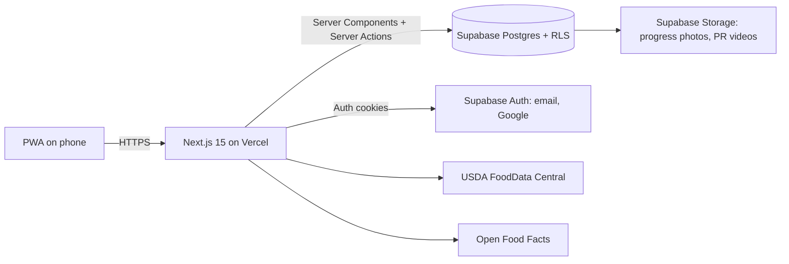

# Architecture

## Shape

**Principles**
- Every formula lives in `src/lib/calc` as a pure function with tests. Pages and actions only fetch data and call these functions.
- Pages are Server Components and mutations are Server Actions, so no separate REST layer is needed for first-party use. The only route handlers are for external food APIs.
- Security sits in the database. Every user table has `user_id = auth.uid()` RLS, so a bug in app code can't leak another user's data.
- Food logs store a macro snapshot, so editing a food never rewrites history.

## ERD (core)

```mermaid
erDiagram
  profiles ||--o{ weight_entries : logs
  profiles ||--o{ body_measurements : logs
  profiles ||--o{ progress_photos : uploads
  profiles ||--o{ macro_targets : sets
  profiles ||--o{ food_logs : eats
  foods ||--o{ food_logs : "logged as"
  recipes ||--o{ recipe_ingredients : contains
  foods ||--o{ recipe_ingredients : "used in"
  recipes ||--o{ meal_prep_inventory : "prepped as"
  profiles ||--o{ meal_plans : plans
  profiles ||--o{ grocery_lists : shops
  profiles ||--o{ workout_sessions : trains
  workout_sessions ||--o{ workout_sets : has
  exercises ||--o{ workout_sets : "performed in"
  profiles ||--o{ personal_records : sets
  profiles ||--o{ habits : tracks
  habits ||--o{ habit_logs : "checked on"
  profiles ||--o{ allowance_weeks : budgets
  profiles ||--o{ allowance_transactions : spends
  profiles ||--o{ bank_accounts : owns
  bank_accounts ||--o{ transactions : posts
  profiles ||--o{ financial_goals : saves
  profiles ||--o{ goals : pursues
  profiles ||--o{ weekly_checkins : grades
  profiles ||--o{ ai_summaries : receives
```

## Key flows

**Sign in.** Email → magic link → `/auth/callback` exchanges the code for a session cookie → `/dashboard`. Google uses the same callback. A database trigger creates the profile, 6 default habits, and the 190 / 500 / 315 / abs goals.

**Allowance week.** Opening Money calls `ensureWeek()`. If this Monday's row doesn't exist, it closes last week, computes rollover (leftover, or overspend carried as a negative), and opens the new week. Each purchase compares spend before and after against the 50/75/90/100% thresholds, so each alert fires exactly once.

**Progressive overload.** The training page reads the last two sessions for each exercise. If every set hit target reps at RPE ≤ 9, it adds 5 lb (upper) or 10 lb (lower). A missed set means repeat the weight. Misses in two sessions running trigger a 10% deload, rounded to 5 lb.

**Alpha Score.** Four pillars at 25% each.
- Body: actual weekly change vs. target pace.
- Nutrition: 60% protein days, 40% calorie days within ±10%.
- Training: completed vs. scheduled split days.
- Money: allowance kept, with a penalty that scales with overspend.

## Production roadmap

| Phase | Scope | Cost |
|---|---|---|
| 1 (this build) | Foundation, body, nutrition, training, allowance, habits, check-in, PWA | Free |
| 2 | Recipe builder, meal prep inventory, shopping list, grocery cost and meal prep ROI | Free |
| 3 | Progress photos (Storage), PR videos, body-fat and protein-vs-weight charts | Free |
| 4 | AI coaches (performance, workout, money, meal plans) via Anthropic API, written to `ai_summaries` | Paid per use |
| 5 | Plaid: link accounts, import transactions, auto-categorize with `category_rules`, auto-feed allowance | Sandbox free; production paid |
| 6 | Apple Sign-In, push notifications for allowance alerts, Sunday check-in reminder | $99/yr Apple dev |
| 7 | Offline write queue (IndexedDB) so logging works with no signal | Free |
